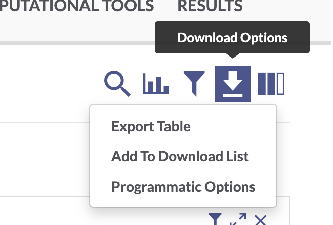

## Setup

### Install synapseclient package

If you haven't already, install `synapseclient` (the [Synapse python client](https://python-docs.synapse.org/build/html/index.html#) package) using pip from the command line.

``` bash
pip3 install --upgrade synapseclient
```

We will also use the python package `pandas` for data wrangling. If you don't have it installed, install from the command line:

``` bash
pip3 install pandas
```

Import the synapseclient and pandas libraries and create a Synapse object.

::: {.cell execution_count=1}
``` {.python .cell-code}
import synapseclient
import pandas as pd
syn = synapseclient.Synapse()
```
:::


### Login to Synapse

Next, you will need to log in to your Synapse account.

Follow these instructions to [generate a personal access token](https://help.synapse.org/docs/Managing-Your-Account.2055405596.html#ManagingYourAccount-Loggingin), then paste the PAT into the code below. Make sure you scope your access token to allow you to View, Download, and Modify.

::: {.cell execution_count=2}
``` {.python .cell-code}
syn.login(authToken = "<paste your personal access token here>")
```
:::


For more information on managing Synapse credentials with `synapseclient`, see the documentation [here](https://python-docs.synapse.org/build/html/Credentials.html). If you have a .synapseCreds file stored in your home directory, you can simply run

::: {.cell execution_count=3}
``` {.python .cell-code}
syn.login()
```
:::


------------------------------------------------------------------------

## Download data

While you can always download data from the AD Portal website via your web browser, it's usually faster and often more convenient to download data programmatically.

### Download a single file

To download a single file from the AD Knowledge Portal, you can click the linked file name to go to a page in the Synapse platform where that file is stored. Using the synID on that page, you can call the `syn.get()` function to download the file.

#### Exercise 1: Use [Explore Data](https://adknowledgeportal.synapse.org/Explore/Data) to find processed RNAseq data from the Jax.IU.Pitt_5XFAD Study

This filters the table to a single file. In the "Id" column for this `htseqcounts_5XFAD.txt` file, there is a unique Synapse ID (synID).

{width="448"}

We can then use that synID to download the file.

::: {.cell execution_count=4}
``` {.python .cell-code}
counts_id ="syn22108847"

counts_file = syn.get(counts_id, downloadLocation = "files/")
```
:::


The variable `counts_file` is a Synapse entity object. It has a variety of attributes, including `.path`, `.properties`, and `.annotations` that contain information about where the file is in Synapse, how it is labeled, what version it is, etc.

::: {.cell execution_count=5}
``` {.python .cell-code}
# this is the entity's synID

counts_file.id
```

::: {.cell-output .cell-output-display execution_count=4}
```
'syn22108847'
```
:::
:::


::: {.cell execution_count=6}
``` {.python .cell-code}
# the local path where the file was download

counts_file.path 
```

::: {.cell-output .cell-output-display execution_count=5}
```
'/Users/alinden/Desktop/sage-repos/originals/ADPortalWorkshops/files/htseqcounts_5XFAD(1).txt'
```
:::
:::


::: {.cell execution_count=7}
``` {.python .cell-code}
# the file version

counts_file.properties.versionNumber
```

::: {.cell-output .cell-output-display execution_count=6}
```
2
```
:::
:::


### Bulk download files {#bulk-download-files}

#### Exercise 2: Use [Explore Studies](https://adknowledgeportal.synapse.org/Explore/Studies) to find all metadata files from the Jax.IU.Pitt_5XFAD study

Use the facets and search bar to look for data you want to download from the AD Knowledge Portal. Once you've identified the files you want, click on the download arrow icon on the top right of the Explore Data table and select "Programmatic Options" from the drop-down menu.

{width="300"}

In the window that pops up, select the "Python" tab from the top menu bar. This will display some Python code that constructs a SQL query of the Synapse data table that drives the AD Knowledge Portal. This query will allow us to download only the files that meet our search criteria.

The function `syn.tableQuery()` returns query results as CSV file that is automatically downloaded to a Synapse cache directory `.synapseCache` in your home directory. You can use `query.filepath` to see the path to the file in the Synapse cache.

::: {.cell execution_count=8}
``` {.python .cell-code}
# download the results of the filtered table query

query = syn.tableQuery("SELECT * FROM syn11346063.37 WHERE ( ( `study` HAS ( 'Jax.IU.Pitt_5XFAD' ) ) AND ( `resourceType` = 'metadata' ) )")

# view the file path of the resulting csv

query.filepath
```

::: {.cell-output .cell-output-display execution_count=7}
```
'/Users/alinden/.synapseCache/769/124438769/SYNAPSE_TABLE_QUERY_124438769.csv'
```
:::
:::


We'll use the pandas function `read.csv` to read the CSV file as a data frame. We can explore the `download_table` object and see that it contains information on all of the AD Portal data files we want to download. Some columns like the "id" and "parentId" columns contain info about where the file is in Synapse, and some columns contain AD Portal annotations for each file, like "dataType", "specimenID", and "assay". This annotation table will later allow us to link downloaded files to additional metadata variables!

::: {.cell execution_count=9}
``` {.python .cell-code}
# read in the table query csv file

download_table = pd.read_csv(query.filepath)
download_table
```

::: {.cell-output .cell-output-display execution_count=8}

```{=html}
<div>
<style scoped>
    .dataframe tbody tr th:only-of-type {
        vertical-align: middle;
    }

    .dataframe tbody tr th {
        vertical-align: top;
    }

    .dataframe thead th {
        text-align: right;
    }
</style>
<table border="1" class="dataframe">
  <thead>
    <tr style="text-align: right;">
      <th></th>
      <th>ROW_ID</th>
      <th>ROW_VERSION</th>
      <th>ROW_ETAG</th>
      <th>id</th>
      <th>name</th>
      <th>study</th>
      <th>dataType</th>
      <th>assay</th>
      <th>organ</th>
      <th>tissue</th>
      <th>...</th>
      <th>currentVersion</th>
      <th>benefactorId</th>
      <th>projectId</th>
      <th>modifiedOn</th>
      <th>modifiedBy</th>
      <th>dataFileHandleId</th>
      <th>metaboliteType</th>
      <th>chromosome</th>
      <th>modelSystemType</th>
      <th>libraryPrep</th>
    </tr>
  </thead>
  <tbody>
    <tr>
      <th>0</th>
      <td>22094731</td>
      <td>2</td>
      <td>84e4bc38-9fb4-429a-a9c0-117e49b26307</td>
      <td>syn22094731</td>
      <td>Jax.IU.Pitt_5XFAD_assay_autorad_metadata.csv</td>
      <td>["Jax.IU.Pitt_5XFAD"]</td>
      <td>["image"]</td>
      <td>["autoradiography"]</td>
      <td>NaN</td>
      <td>NaN</td>
      <td>...</td>
      <td>2</td>
      <td>syn2580853</td>
      <td>syn2580853</td>
      <td>1634772340295</td>
      <td>3420438</td>
      <td>75355920</td>
      <td>NaN</td>
      <td>NaN</td>
      <td>animal</td>
      <td>NaN</td>
    </tr>
    <tr>
      <th>1</th>
      <td>22094732</td>
      <td>2</td>
      <td>266ec572-1c42-4880-8071-58fb4bafd61d</td>
      <td>syn22094732</td>
      <td>Jax.IU.Pitt_5XFAD_assay_PET_metadata.csv</td>
      <td>["Jax.IU.Pitt_5XFAD"]</td>
      <td>["image"]</td>
      <td>["Positron Emission Tomography"]</td>
      <td>NaN</td>
      <td>NaN</td>
      <td>...</td>
      <td>2</td>
      <td>syn2580853</td>
      <td>syn2580853</td>
      <td>1634772340339</td>
      <td>3420438</td>
      <td>75355925</td>
      <td>NaN</td>
      <td>NaN</td>
      <td>animal</td>
      <td>NaN</td>
    </tr>
    <tr>
      <th>2</th>
      <td>22103212</td>
      <td>3</td>
      <td>7229ee91-435e-4c26-b9c1-ab623125f65e</td>
      <td>syn22103212</td>
      <td>Jax.IU.Pitt_5XFAD_individual_metadata.csv</td>
      <td>["Jax.IU.Pitt_5XFAD"]</td>
      <td>NaN</td>
      <td>NaN</td>
      <td>NaN</td>
      <td>NaN</td>
      <td>...</td>
      <td>3</td>
      <td>syn2580853</td>
      <td>syn2580853</td>
      <td>1642645133885</td>
      <td>3427512</td>
      <td>87202568</td>
      <td>NaN</td>
      <td>NaN</td>
      <td>animal</td>
      <td>NaN</td>
    </tr>
    <tr>
      <th>3</th>
      <td>22103213</td>
      <td>3</td>
      <td>ce970c4c-d929-4e55-828e-5b298a59c204</td>
      <td>syn22103213</td>
      <td>Jax.IU.Pitt_5XFAD_biospecimen_metadata.csv</td>
      <td>["Jax.IU.Pitt_5XFAD"]</td>
      <td>NaN</td>
      <td>NaN</td>
      <td>NaN</td>
      <td>NaN</td>
      <td>...</td>
      <td>3</td>
      <td>syn2580853</td>
      <td>syn2580853</td>
      <td>1634772352884</td>
      <td>3420438</td>
      <td>75356382</td>
      <td>NaN</td>
      <td>NaN</td>
      <td>animal</td>
      <td>NaN</td>
    </tr>
    <tr>
      <th>4</th>
      <td>22110328</td>
      <td>4</td>
      <td>20cf3097-4cb0-4507-9e59-1087c3c9ab71</td>
      <td>syn22110328</td>
      <td>Jax.IU.Pitt_5XFAD_assay_RNAseq_metadata.csv</td>
      <td>["Jax.IU.Pitt_5XFAD"]</td>
      <td>["geneExpression"]</td>
      <td>["rnaSeq"]</td>
      <td>NaN</td>
      <td>NaN</td>
      <td>...</td>
      <td>4</td>
      <td>syn2580853</td>
      <td>syn2580853</td>
      <td>1634772370968</td>
      <td>3420438</td>
      <td>75357585</td>
      <td>NaN</td>
      <td>NaN</td>
      <td>animal</td>
      <td>NaN</td>
    </tr>
  </tbody>
</table>
<p>5 rows × 45 columns</p>
</div>
```

:::
:::


Finally, we can use a for loop to loop through the "id" column and apply the `syn.get()` function to each file's synID.

::: {.cell execution_count=10}
``` {.python .cell-code}
# loop through the column of synIDs and download each file

for id in download_table.id:
  syn.get(id, downloadLocation = "files/")
```
:::


Congratulations, you have bulk downloaded files from the AD Knowledge Portal!

------------------------------------------------------------------------

## Working with AD Portal metadata

### Metadata basics

We have now downloaded several metadata files and an RNAseq counts file from the portal. For our next exercises, we want to read those files in as R data so we can work with them.

We can see from the `download_table` we got during the bulk download step that we have five metadata files. Two of these should be the individual and biospecimen files, and three of them are assay meetadata files.

::: {.cell execution_count=11}
``` {.python .cell-code}
download_table[['name', 'metadataType', 'assay']]
```

::: {.cell-output .cell-output-display execution_count=10}

```{=html}
<div>
<style scoped>
    .dataframe tbody tr th:only-of-type {
        vertical-align: middle;
    }

    .dataframe tbody tr th {
        vertical-align: top;
    }

    .dataframe thead th {
        text-align: right;
    }
</style>
<table border="1" class="dataframe">
  <thead>
    <tr style="text-align: right;">
      <th></th>
      <th>name</th>
      <th>metadataType</th>
      <th>assay</th>
    </tr>
  </thead>
  <tbody>
    <tr>
      <th>0</th>
      <td>Jax.IU.Pitt_5XFAD_assay_autorad_metadata.csv</td>
      <td>assay</td>
      <td>["autoradiography"]</td>
    </tr>
    <tr>
      <th>1</th>
      <td>Jax.IU.Pitt_5XFAD_assay_PET_metadata.csv</td>
      <td>assay</td>
      <td>["Positron Emission Tomography"]</td>
    </tr>
    <tr>
      <th>2</th>
      <td>Jax.IU.Pitt_5XFAD_individual_metadata.csv</td>
      <td>individual</td>
      <td>NaN</td>
    </tr>
    <tr>
      <th>3</th>
      <td>Jax.IU.Pitt_5XFAD_biospecimen_metadata.csv</td>
      <td>biospecimen</td>
      <td>NaN</td>
    </tr>
    <tr>
      <th>4</th>
      <td>Jax.IU.Pitt_5XFAD_assay_RNAseq_metadata.csv</td>
      <td>assay</td>
      <td>["rnaSeq"]</td>
    </tr>
  </tbody>
</table>
</div>
```

:::
:::


We are only interested in RNAseq data, so we will only read in the individual, biospecimen, and RNAseq assay metadata files. We will also read in the counts data file.

::: {.cell execution_count=12}
``` {.python .cell-code}
# counts matrix

counts = pd.read_table("files/htseqcounts_5XFAD.txt")

# individual metadata

ind_meta = pd.read_csv("files/Jax.IU.Pitt_5XFAD_individual_metadata.csv")

# biospecimen metadata

bio_meta = pd.read_csv("files/Jax.IU.Pitt_5XFAD_biospecimen_metadata.csv")

#assay metadata

rna_meta = pd.read_csv("files/Jax.IU.Pitt_5XFAD_assay_RNAseq_metadata.csv")
```
:::


Let's examine the data and metadata files a bit before we begin our analyses.

#### Counts data

::: {.cell execution_count=13}
``` {.python .cell-code}
counts.head()
```

::: {.cell-output .cell-output-display execution_count=12}

```{=html}
<div>
<style scoped>
    .dataframe tbody tr th:only-of-type {
        vertical-align: middle;
    }

    .dataframe tbody tr th {
        vertical-align: top;
    }

    .dataframe thead th {
        text-align: right;
    }
</style>
<table border="1" class="dataframe">
  <thead>
    <tr style="text-align: right;">
      <th></th>
      <th>gene_id</th>
      <th>32043rh</th>
      <th>32044rh</th>
      <th>32046rh</th>
      <th>32047rh</th>
      <th>32048rh</th>
      <th>32049rh</th>
      <th>32050rh</th>
      <th>32052rh</th>
      <th>32053rh</th>
      <th>...</th>
      <th>46887rh</th>
      <th>46888rh</th>
      <th>46889rh</th>
      <th>46890rh</th>
      <th>46891rh</th>
      <th>46892rh</th>
      <th>46893rh</th>
      <th>46895rh</th>
      <th>46896rh</th>
      <th>46897rh</th>
    </tr>
  </thead>
  <tbody>
    <tr>
      <th>0</th>
      <td>ENSG00000080815</td>
      <td>22554</td>
      <td>0</td>
      <td>0</td>
      <td>0</td>
      <td>16700</td>
      <td>0</td>
      <td>0</td>
      <td>19748</td>
      <td>14023</td>
      <td>...</td>
      <td>16072</td>
      <td>0</td>
      <td>16680</td>
      <td>13367</td>
      <td>0</td>
      <td>25119</td>
      <td>92</td>
      <td>0</td>
      <td>15934</td>
      <td>0</td>
    </tr>
    <tr>
      <th>1</th>
      <td>ENSG00000142192</td>
      <td>344489</td>
      <td>4</td>
      <td>0</td>
      <td>1</td>
      <td>260935</td>
      <td>6</td>
      <td>8</td>
      <td>337456</td>
      <td>206851</td>
      <td>...</td>
      <td>258061</td>
      <td>0</td>
      <td>235530</td>
      <td>196721</td>
      <td>0</td>
      <td>371037</td>
      <td>1116</td>
      <td>0</td>
      <td>235343</td>
      <td>6</td>
    </tr>
    <tr>
      <th>2</th>
      <td>ENSMUSG00000000001</td>
      <td>5061</td>
      <td>3483</td>
      <td>3941</td>
      <td>3088</td>
      <td>2756</td>
      <td>3067</td>
      <td>2711</td>
      <td>3334</td>
      <td>3841</td>
      <td>...</td>
      <td>3719</td>
      <td>3899</td>
      <td>4173</td>
      <td>4008</td>
      <td>3037</td>
      <td>5967</td>
      <td>3459</td>
      <td>4262</td>
      <td>3923</td>
      <td>3486</td>
    </tr>
    <tr>
      <th>3</th>
      <td>ENSMUSG00000000003</td>
      <td>0</td>
      <td>0</td>
      <td>0</td>
      <td>0</td>
      <td>0</td>
      <td>0</td>
      <td>0</td>
      <td>0</td>
      <td>0</td>
      <td>...</td>
      <td>0</td>
      <td>0</td>
      <td>0</td>
      <td>0</td>
      <td>0</td>
      <td>0</td>
      <td>0</td>
      <td>0</td>
      <td>0</td>
      <td>0</td>
    </tr>
    <tr>
      <th>4</th>
      <td>ENSMUSG00000000028</td>
      <td>208</td>
      <td>162</td>
      <td>138</td>
      <td>127</td>
      <td>95</td>
      <td>154</td>
      <td>165</td>
      <td>124</td>
      <td>103</td>
      <td>...</td>
      <td>128</td>
      <td>210</td>
      <td>127</td>
      <td>156</td>
      <td>116</td>
      <td>260</td>
      <td>161</td>
      <td>189</td>
      <td>179</td>
      <td>117</td>
    </tr>
  </tbody>
</table>
<p>5 rows × 73 columns</p>
</div>
```

:::
:::


The data file has a column of ENSEMBL gene ids and then a bunch of columns with count data, where the column headers correspond to the specimenIDs. These specimenIDs should all be in the RNAseq assay metadata file, so let's check.

::: {.cell execution_count=14}
``` {.python .cell-code}
rna_meta.head()
```

::: {.cell-output .cell-output-display execution_count=13}

```{=html}
<div>
<style scoped>
    .dataframe tbody tr th:only-of-type {
        vertical-align: middle;
    }

    .dataframe tbody tr th {
        vertical-align: top;
    }

    .dataframe thead th {
        text-align: right;
    }
</style>
<table border="1" class="dataframe">
  <thead>
    <tr style="text-align: right;">
      <th></th>
      <th>specimenID</th>
      <th>platform</th>
      <th>RIN</th>
      <th>rnaBatch</th>
      <th>libraryBatch</th>
      <th>sequencingBatch</th>
      <th>libraryPrep</th>
      <th>libraryPreparationMethod</th>
      <th>isStranded</th>
      <th>readStrandOrigin</th>
      <th>runType</th>
      <th>readLength</th>
    </tr>
  </thead>
  <tbody>
    <tr>
      <th>0</th>
      <td>32043rh</td>
      <td>IlluminaNovaseq6000</td>
      <td>NaN</td>
      <td>1</td>
      <td>1</td>
      <td>1</td>
      <td>polyAselection</td>
      <td>NaN</td>
      <td>false</td>
      <td>NaN</td>
      <td>pairedEnd</td>
      <td>101</td>
    </tr>
    <tr>
      <th>1</th>
      <td>32044rh</td>
      <td>IlluminaNovaseq6000</td>
      <td>NaN</td>
      <td>1</td>
      <td>1</td>
      <td>1</td>
      <td>polyAselection</td>
      <td>NaN</td>
      <td>false</td>
      <td>NaN</td>
      <td>pairedEnd</td>
      <td>101</td>
    </tr>
    <tr>
      <th>2</th>
      <td>32046rh</td>
      <td>IlluminaNovaseq6000</td>
      <td>NaN</td>
      <td>1</td>
      <td>1</td>
      <td>1</td>
      <td>polyAselection</td>
      <td>NaN</td>
      <td>false</td>
      <td>NaN</td>
      <td>pairedEnd</td>
      <td>101</td>
    </tr>
    <tr>
      <th>3</th>
      <td>32047rh</td>
      <td>IlluminaNovaseq6000</td>
      <td>NaN</td>
      <td>1</td>
      <td>1</td>
      <td>1</td>
      <td>polyAselection</td>
      <td>NaN</td>
      <td>false</td>
      <td>NaN</td>
      <td>pairedEnd</td>
      <td>101</td>
    </tr>
    <tr>
      <th>4</th>
      <td>32049rh</td>
      <td>IlluminaNovaseq6000</td>
      <td>NaN</td>
      <td>1</td>
      <td>1</td>
      <td>1</td>
      <td>polyAselection</td>
      <td>NaN</td>
      <td>false</td>
      <td>NaN</td>
      <td>pairedEnd</td>
      <td>101</td>
    </tr>
  </tbody>
</table>
</div>
```

:::
:::


::: {.cell execution_count=15}
``` {.python .cell-code}
# check that column headers in counts file match specimenIDs in assay metadata

col_names = list(counts.columns.values)[1:]

spec_ids = list(rna_meta.specimenID)

all(item in col_names for item in spec_ids)
```

::: {.cell-output .cell-output-display execution_count=14}
```
True
```
:::
:::


#### Assay metadata

The assay metadata contains information about how data was generated on each sample in the assay. Each specimenID represents a unique sample. We can use some tools from pandas to explore the metadata.

::: {.cell execution_count=16}
``` {.python .cell-code}
# how many unique specimens were sequenced?

rna_meta['specimenID'].nunique()
```

::: {.cell-output .cell-output-display execution_count=15}
```
72
```
:::
:::


::: {.cell execution_count=17}
``` {.python .cell-code}
# were the samples all sequenced on the same platform, and in the same
# sequencing batch?

rna_meta[['platform', 'sequencingBatch']].nunique()
```

::: {.cell-output .cell-output-display execution_count=16}
```
platform           1
sequencingBatch    1
dtype: int64
```
:::
:::


#### Biospecimen metadata

The biospecimen metadata contains specimen-level information, including organ and tissue the specimen was taken from, how it was prepared, etc. Each specimenID is mapped to an individualID.

::: {.cell execution_count=18}
``` {.python .cell-code}
# all specimens from the RNAseq assay metadata file should be in the biospecimen
# file

rna_meta['specimenID'].isin(bio_meta['specimenID']).value_counts()
```

::: {.cell-output .cell-output-display execution_count=17}
```
True    72
Name: specimenID, dtype: int64
```
:::
:::


::: {.cell execution_count=19}
``` {.python .cell-code}
# but the biospecimen file also contains specimens from different assays

bio_meta['specimenID'].isin(rna_meta['specimenID']).value_counts()
```

::: {.cell-output .cell-output-display execution_count=18}
```
False    502
True      72
Name: specimenID, dtype: int64
```
:::
:::


#### Individual metadata

The individual metadata contains information about all the individuals in the study, represented by unique individualIDs. For humans, this includes information on age, sex, race, diagnosis, etc. For MODEL-AD mouse models, the individual metadata has information on model genotypes, stock numbers, diet, and more.

::: {.cell execution_count=20}
``` {.python .cell-code}
# all individualIDs in the biospecimen file should be in the individual file

bio_meta['individualID'].isin(ind_meta['individualID']).value_counts()

# which model genotypes are in this study?

ind_meta['genotype'].unique()
```

::: {.cell-output .cell-output-display execution_count=19}
```
array(['5XFAD_carrier', '5XFAD_noncarrier'], dtype=object)
```
:::
:::


#### Joining metadata

We use the three-file structure for our metadata because it allows us to store metadata for each study in a tidy format. Every line in the assay and biospecimen files represents a unique specimen, and every line in the individual file represents a unique individual. This means the files can be easily joined by specimenID and individualID to get all levels of metadata that apply to a particular data file. We will use the `merge()` function from `pandas`, with the `how = "left"` option to specify a left join.

::: {.cell execution_count=21}
``` {.python .cell-code}
# join all the rows in the assay metadata that have a match in the biospecimen
# metadata, then join all the rows in that dataframe to all rows that have a
# match in the individual metadata

joined_meta = rna_meta.merge(bio_meta, how = "left", on = "specimenID").merge(ind_meta, how = "left", on = "individualID")

joined_meta
```

::: {.cell-output .cell-output-display execution_count=20}

```{=html}
<div>
<style scoped>
    .dataframe tbody tr th:only-of-type {
        vertical-align: middle;
    }

    .dataframe tbody tr th {
        vertical-align: top;
    }

    .dataframe thead th {
        text-align: right;
    }
</style>
<table border="1" class="dataframe">
  <thead>
    <tr style="text-align: right;">
      <th></th>
      <th>specimenID</th>
      <th>platform</th>
      <th>RIN</th>
      <th>rnaBatch</th>
      <th>libraryBatch</th>
      <th>sequencingBatch</th>
      <th>libraryPrep</th>
      <th>libraryPreparationMethod</th>
      <th>isStranded</th>
      <th>readStrandOrigin</th>
      <th>...</th>
      <th>Generation</th>
      <th>AnimalMatingStatus</th>
      <th>Comments</th>
      <th>jobNumber</th>
      <th>Microchip Number</th>
      <th>Diet</th>
      <th>Birth ID</th>
      <th>brainWeight</th>
      <th>animalWeight</th>
      <th>modelCommonName</th>
    </tr>
  </thead>
  <tbody>
    <tr>
      <th>0</th>
      <td>32043rh</td>
      <td>IlluminaNovaseq6000</td>
      <td>NaN</td>
      <td>1</td>
      <td>1</td>
      <td>1</td>
      <td>polyAselection</td>
      <td>NaN</td>
      <td>false</td>
      <td>NaN</td>
      <td>...</td>
      <td>N1F3</td>
      <td>Virgin</td>
      <td>NaN</td>
      <td>JAX 5xFAD 12mo</td>
      <td>288646853.0</td>
      <td>6%</td>
      <td>NaN</td>
      <td>0.503</td>
      <td>28.76</td>
      <td>5XFAD</td>
    </tr>
    <tr>
      <th>1</th>
      <td>32044rh</td>
      <td>IlluminaNovaseq6000</td>
      <td>NaN</td>
      <td>1</td>
      <td>1</td>
      <td>1</td>
      <td>polyAselection</td>
      <td>NaN</td>
      <td>false</td>
      <td>NaN</td>
      <td>...</td>
      <td>N1F3</td>
      <td>Virgin</td>
      <td>NaN</td>
      <td>JAX 5xFAD 12mo</td>
      <td>289822454.0</td>
      <td>6%</td>
      <td>NaN</td>
      <td>0.482</td>
      <td>46.51</td>
      <td>5XFAD</td>
    </tr>
    <tr>
      <th>2</th>
      <td>32046rh</td>
      <td>IlluminaNovaseq6000</td>
      <td>NaN</td>
      <td>1</td>
      <td>1</td>
      <td>1</td>
      <td>polyAselection</td>
      <td>NaN</td>
      <td>false</td>
      <td>NaN</td>
      <td>...</td>
      <td>N1F3</td>
      <td>Virgin</td>
      <td>NaN</td>
      <td>JAX 5xFAD 12mo</td>
      <td>289859181.0</td>
      <td>6%</td>
      <td>NaN</td>
      <td>0.470</td>
      <td>41.00</td>
      <td>5XFAD</td>
    </tr>
    <tr>
      <th>3</th>
      <td>32047rh</td>
      <td>IlluminaNovaseq6000</td>
      <td>NaN</td>
      <td>1</td>
      <td>1</td>
      <td>1</td>
      <td>polyAselection</td>
      <td>NaN</td>
      <td>false</td>
      <td>NaN</td>
      <td>...</td>
      <td>N1F3</td>
      <td>Virgin</td>
      <td>NaN</td>
      <td>JAX 5xFAD 12mo</td>
      <td>289777416.0</td>
      <td>6%</td>
      <td>NaN</td>
      <td>0.454</td>
      <td>42.89</td>
      <td>5XFAD</td>
    </tr>
    <tr>
      <th>4</th>
      <td>32049rh</td>
      <td>IlluminaNovaseq6000</td>
      <td>NaN</td>
      <td>1</td>
      <td>1</td>
      <td>1</td>
      <td>polyAselection</td>
      <td>NaN</td>
      <td>false</td>
      <td>NaN</td>
      <td>...</td>
      <td>N1F4</td>
      <td>Virgin</td>
      <td>NaN</td>
      <td>JAX 5xFAD 12mo</td>
      <td>288770010.0</td>
      <td>6%</td>
      <td>NaN</td>
      <td>0.489</td>
      <td>29.96</td>
      <td>5XFAD</td>
    </tr>
    <tr>
      <th>...</th>
      <td>...</td>
      <td>...</td>
      <td>...</td>
      <td>...</td>
      <td>...</td>
      <td>...</td>
      <td>...</td>
      <td>...</td>
      <td>...</td>
      <td>...</td>
      <td>...</td>
      <td>...</td>
      <td>...</td>
      <td>...</td>
      <td>...</td>
      <td>...</td>
      <td>...</td>
      <td>...</td>
      <td>...</td>
      <td>...</td>
      <td>...</td>
    </tr>
    <tr>
      <th>67</th>
      <td>46886rh</td>
      <td>IlluminaNovaseq6000</td>
      <td>NaN</td>
      <td>1</td>
      <td>1</td>
      <td>1</td>
      <td>polyAselection</td>
      <td>NaN</td>
      <td>false</td>
      <td>NaN</td>
      <td>...</td>
      <td>N1F4</td>
      <td>Virgin</td>
      <td>NaN</td>
      <td>JAX DMP 5xFAD 6month</td>
      <td>NaN</td>
      <td>6%</td>
      <td>NaN</td>
      <td>0.433</td>
      <td>24.23</td>
      <td>5XFAD</td>
    </tr>
    <tr>
      <th>68</th>
      <td>46889rh</td>
      <td>IlluminaNovaseq6000</td>
      <td>NaN</td>
      <td>1</td>
      <td>1</td>
      <td>1</td>
      <td>polyAselection</td>
      <td>NaN</td>
      <td>false</td>
      <td>NaN</td>
      <td>...</td>
      <td>N1F4</td>
      <td>Virgin</td>
      <td>NaN</td>
      <td>JAX DMP 5xFAD 6month</td>
      <td>NaN</td>
      <td>6%</td>
      <td>NaN</td>
      <td>0.452</td>
      <td>30.94</td>
      <td>5XFAD</td>
    </tr>
    <tr>
      <th>69</th>
      <td>46890rh</td>
      <td>IlluminaNovaseq6000</td>
      <td>NaN</td>
      <td>1</td>
      <td>1</td>
      <td>1</td>
      <td>polyAselection</td>
      <td>NaN</td>
      <td>false</td>
      <td>NaN</td>
      <td>...</td>
      <td>N1F4</td>
      <td>Virgin</td>
      <td>NaN</td>
      <td>JAX DMP 5xFAD 6month</td>
      <td>NaN</td>
      <td>6%</td>
      <td>NaN</td>
      <td>0.424</td>
      <td>32.50</td>
      <td>5XFAD</td>
    </tr>
    <tr>
      <th>70</th>
      <td>46892rh</td>
      <td>IlluminaNovaseq6000</td>
      <td>NaN</td>
      <td>1</td>
      <td>1</td>
      <td>1</td>
      <td>polyAselection</td>
      <td>NaN</td>
      <td>false</td>
      <td>NaN</td>
      <td>...</td>
      <td>N1F4</td>
      <td>Virgin</td>
      <td>NaN</td>
      <td>JAX DMP 5xFAD 6month</td>
      <td>NaN</td>
      <td>6%</td>
      <td>NaN</td>
      <td>0.491</td>
      <td>30.54</td>
      <td>5XFAD</td>
    </tr>
    <tr>
      <th>71</th>
      <td>46896rh</td>
      <td>IlluminaNovaseq6000</td>
      <td>NaN</td>
      <td>1</td>
      <td>1</td>
      <td>1</td>
      <td>polyAselection</td>
      <td>NaN</td>
      <td>false</td>
      <td>NaN</td>
      <td>...</td>
      <td>N1F4</td>
      <td>Virgin</td>
      <td>NaN</td>
      <td>JAX DMP 5xFAD 4month</td>
      <td>NaN</td>
      <td>6%</td>
      <td>NaN</td>
      <td>0.499</td>
      <td>28.78</td>
      <td>5XFAD</td>
    </tr>
  </tbody>
</table>
<p>72 rows × 56 columns</p>
</div>
```

:::
:::


We now have a very wide dataframe that contains all the available metadata on each specimen in the RNAseq data from this study. This procedure can be used to join the three types of metadata files for every study in the AD Knowledge Portal, allowing you to filter individuals and specimens as needed based on your analysis criteria!

### Single-specimen files

For files that contain data from a single specimen (e.g. raw sequencing files, raw mass spectra, etc.), we can use the Synapse annotations to associate these files with the appropriate metadata.

#### Excercise 3: Use [Explore Data](https://adknowledgeportal.synapse.org/Explore/Data) to find *all* RNAseq files from the Jax.IU.Pitt_5XFAD study.

If we filter for data where Study = "Jax.IU.Pitt_5XFAD" and Assay = "rnaSeq" we will get a list of 148 files, including raw fastqs and processed counts data.

#### Synapse entity annotations

We can use the function `syn.get_annotations()` to view the annotations associated with any file without downloading the file.

::: {.cell execution_count=22}
``` {.python .cell-code}
# the synID of a random fastq file from our filtered search of fastq files

random_fastq = "syn22108503"

# extract the annotations as a dict

fastq_annotations = syn.get_annotations(random_fastq)

fastq_annotations
```

::: {.cell-output .cell-output-display execution_count=21}
```
{'sex': ['female'],
 'assay': ['rnaSeq'],
 'grant': ['U54AG054345'],
 'organ': ['brain'],
 'study': ['Jax.IU.Pitt_5XFAD'],
 'tissue': ['right cerebral hemisphere'],
 'species': ['Mouse'],
 'dataType': ['geneExpression'],
 'consortium': ['MODEL-AD'],
 'fileFormat': ['fastq'],
 'specimenID': ['32043rh'],
 'dataSubtype': ['raw'],
 'individualID': ['32043'],
 'resourceType': ['experimentalData'],
 'isModelSystem': [False],
 'isMultiSpecimen': [False],
 'modelSystemName': ['5XFAD'],
 'modelSystemType': ['animal'],
 'nucleicAcidSource': ['bulk cell'],
 'individualIdSource': ['JAX']}
```
:::
:::


The file annotations let us see which study the file is associated with (Jax.IU.Pitt.5XFAD), which species it's from (Mouse), which assay generated the file (rnaSeq), and a whole bunch of other properties. Most importantly, single-specimen files are annotated with with the specimenID of the specimen in the file, and the individualID of the individual that specimen was taken from. We can use these annotations to link files to the rest of the metadata, including metadata that is not in annotations. This is especially helpful for human studies, as potentially identifying information like age, race, and diagnosis is not included in file annotations.

::: {.cell execution_count=23}
``` {.python .cell-code}
# find records belonging to the individual this file maps to in our joined
# metadata the annotation value is a string but the individualID column in the
# metadat is type int so we have to convert

joined_meta[(joined_meta['individualID'] == int(fastq_annotations['individualID'][0]))]
```

::: {.cell-output .cell-output-display execution_count=22}

```{=html}
<div>
<style scoped>
    .dataframe tbody tr th:only-of-type {
        vertical-align: middle;
    }

    .dataframe tbody tr th {
        vertical-align: top;
    }

    .dataframe thead th {
        text-align: right;
    }
</style>
<table border="1" class="dataframe">
  <thead>
    <tr style="text-align: right;">
      <th></th>
      <th>specimenID</th>
      <th>platform</th>
      <th>RIN</th>
      <th>rnaBatch</th>
      <th>libraryBatch</th>
      <th>sequencingBatch</th>
      <th>libraryPrep</th>
      <th>libraryPreparationMethod</th>
      <th>isStranded</th>
      <th>readStrandOrigin</th>
      <th>...</th>
      <th>Generation</th>
      <th>AnimalMatingStatus</th>
      <th>Comments</th>
      <th>jobNumber</th>
      <th>Microchip Number</th>
      <th>Diet</th>
      <th>Birth ID</th>
      <th>brainWeight</th>
      <th>animalWeight</th>
      <th>modelCommonName</th>
    </tr>
  </thead>
  <tbody>
    <tr>
      <th>0</th>
      <td>32043rh</td>
      <td>IlluminaNovaseq6000</td>
      <td>NaN</td>
      <td>1</td>
      <td>1</td>
      <td>1</td>
      <td>polyAselection</td>
      <td>NaN</td>
      <td>false</td>
      <td>NaN</td>
      <td>...</td>
      <td>N1F3</td>
      <td>Virgin</td>
      <td>NaN</td>
      <td>JAX 5xFAD 12mo</td>
      <td>288646853.0</td>
      <td>6%</td>
      <td>NaN</td>
      <td>0.503</td>
      <td>28.76</td>
      <td>5XFAD</td>
    </tr>
  </tbody>
</table>
<p>1 rows × 56 columns</p>
</div>
```

:::
:::


#### Annotations during bulk download

When bulk downloading many files, the best practice is to preserve the download manifest that is generated which lists all the files, their synIDs, and all their annotations. If using the Synapse R client, follow the instructions in the [Bulk download files](#bulk-download-files) section above.

If we use the "Programmatic Options" tab in the AD Portal download menu to download all 148 rnaSeq files from the 5XFAD study, we would get a table query that looks like this:

::: {.cell execution_count=24}
``` {.python .cell-code}
query = syn.tableQuery("SELECT * FROM syn11346063.37 WHERE ( ( \"study\" HAS ( 'Jax.IU.Pitt_5XFAD' ) ) AND ( \"assay\" HAS ( 'rnaSeq' ) ) )")
```
:::


As we saw previously, this downloads a csv file with the results of our AD Portal query. Opening that file lets us see which specimens are associated with which files:

::: {.cell execution_count=25}
``` {.python .cell-code}
annotations_table = pd.read_csv(query.filepath)

annotations_table
```

::: {.cell-output .cell-output-display execution_count=24}

```{=html}
<div>
<style scoped>
    .dataframe tbody tr th:only-of-type {
        vertical-align: middle;
    }

    .dataframe tbody tr th {
        vertical-align: top;
    }

    .dataframe thead th {
        text-align: right;
    }
</style>
<table border="1" class="dataframe">
  <thead>
    <tr style="text-align: right;">
      <th></th>
      <th>ROW_ID</th>
      <th>ROW_VERSION</th>
      <th>ROW_ETAG</th>
      <th>id</th>
      <th>name</th>
      <th>study</th>
      <th>dataType</th>
      <th>assay</th>
      <th>organ</th>
      <th>tissue</th>
      <th>...</th>
      <th>currentVersion</th>
      <th>benefactorId</th>
      <th>projectId</th>
      <th>modifiedOn</th>
      <th>modifiedBy</th>
      <th>dataFileHandleId</th>
      <th>metaboliteType</th>
      <th>chromosome</th>
      <th>modelSystemType</th>
      <th>libraryPrep</th>
    </tr>
  </thead>
  <tbody>
    <tr>
      <th>0</th>
      <td>22108503</td>
      <td>1</td>
      <td>458ff182-d2e4-4c11-a8c0-137ea8d4a816</td>
      <td>syn22108503</td>
      <td>32043_GT19_12829_CCGCGGTT-AGCGCTAG_R1_001.fast...</td>
      <td>["Jax.IU.Pitt_5XFAD"]</td>
      <td>["geneExpression"]</td>
      <td>["rnaSeq"]</td>
      <td>brain</td>
      <td>["right cerebral hemisphere"]</td>
      <td>...</td>
      <td>1</td>
      <td>syn2580853</td>
      <td>syn2580853</td>
      <td>1634772363992</td>
      <td>3420438</td>
      <td>75357319</td>
      <td>NaN</td>
      <td>NaN</td>
      <td>animal</td>
      <td>NaN</td>
    </tr>
    <tr>
      <th>1</th>
      <td>22108508</td>
      <td>1</td>
      <td>163d5067-924a-422d-ba92-e4d879a5f39e</td>
      <td>syn22108508</td>
      <td>32044_GT19_12856_GGAGCGTC-GTCCGTGC_R1_001.fast...</td>
      <td>["Jax.IU.Pitt_5XFAD"]</td>
      <td>["geneExpression"]</td>
      <td>["rnaSeq"]</td>
      <td>brain</td>
      <td>["right cerebral hemisphere"]</td>
      <td>...</td>
      <td>1</td>
      <td>syn2580853</td>
      <td>syn2580853</td>
      <td>1634772364039</td>
      <td>3420438</td>
      <td>75357320</td>
      <td>NaN</td>
      <td>NaN</td>
      <td>animal</td>
      <td>NaN</td>
    </tr>
    <tr>
      <th>2</th>
      <td>22108512</td>
      <td>1</td>
      <td>d02e16c5-78b6-42d1-9f38-a372b99159b6</td>
      <td>syn22108512</td>
      <td>32046_GT19_12865_CAACAATG-CTTCACGG_R1_001.fast...</td>
      <td>["Jax.IU.Pitt_5XFAD"]</td>
      <td>["geneExpression"]</td>
      <td>["rnaSeq"]</td>
      <td>brain</td>
      <td>["right cerebral hemisphere"]</td>
      <td>...</td>
      <td>1</td>
      <td>syn2580853</td>
      <td>syn2580853</td>
      <td>1634772364086</td>
      <td>3420438</td>
      <td>75357321</td>
      <td>NaN</td>
      <td>NaN</td>
      <td>animal</td>
      <td>NaN</td>
    </tr>
    <tr>
      <th>3</th>
      <td>22108519</td>
      <td>1</td>
      <td>59eba082-82ed-4dd5-8aff-f07e0a57938e</td>
      <td>syn22108519</td>
      <td>32047_GT19_12836_ATGAGGCC-GTTAATTG_R1_001.fast...</td>
      <td>["Jax.IU.Pitt_5XFAD"]</td>
      <td>["geneExpression"]</td>
      <td>["rnaSeq"]</td>
      <td>brain</td>
      <td>["right cerebral hemisphere"]</td>
      <td>...</td>
      <td>1</td>
      <td>syn2580853</td>
      <td>syn2580853</td>
      <td>1634772364132</td>
      <td>3420438</td>
      <td>75357323</td>
      <td>NaN</td>
      <td>NaN</td>
      <td>animal</td>
      <td>NaN</td>
    </tr>
    <tr>
      <th>4</th>
      <td>22108525</td>
      <td>1</td>
      <td>9fed0677-e8c3-4caf-8dac-72f171e2f30e</td>
      <td>syn22108525</td>
      <td>32049_GT19_12881_GCCACAGG-CATGCCAT_R1_001.fast...</td>
      <td>["Jax.IU.Pitt_5XFAD"]</td>
      <td>["geneExpression"]</td>
      <td>["rnaSeq"]</td>
      <td>brain</td>
      <td>["right cerebral hemisphere"]</td>
      <td>...</td>
      <td>1</td>
      <td>syn2580853</td>
      <td>syn2580853</td>
      <td>1634772364177</td>
      <td>3420438</td>
      <td>75357322</td>
      <td>NaN</td>
      <td>NaN</td>
      <td>animal</td>
      <td>NaN</td>
    </tr>
    <tr>
      <th>...</th>
      <td>...</td>
      <td>...</td>
      <td>...</td>
      <td>...</td>
      <td>...</td>
      <td>...</td>
      <td>...</td>
      <td>...</td>
      <td>...</td>
      <td>...</td>
      <td>...</td>
      <td>...</td>
      <td>...</td>
      <td>...</td>
      <td>...</td>
      <td>...</td>
      <td>...</td>
      <td>...</td>
      <td>...</td>
      <td>...</td>
      <td>...</td>
    </tr>
    <tr>
      <th>143</th>
      <td>22108846</td>
      <td>1</td>
      <td>4768dbae-386d-4b97-ad45-45ac9e7434a8</td>
      <td>syn22108846</td>
      <td>46896_GT19_12890_CATAGAGT-TGCCACCA_R2_001.fast...</td>
      <td>["Jax.IU.Pitt_5XFAD"]</td>
      <td>["geneExpression"]</td>
      <td>["rnaSeq"]</td>
      <td>brain</td>
      <td>["right cerebral hemisphere"]</td>
      <td>...</td>
      <td>1</td>
      <td>syn2580853</td>
      <td>syn2580853</td>
      <td>1634772370763</td>
      <td>3420438</td>
      <td>75357566</td>
      <td>NaN</td>
      <td>NaN</td>
      <td>animal</td>
      <td>NaN</td>
    </tr>
    <tr>
      <th>144</th>
      <td>22108847</td>
      <td>2</td>
      <td>fae06229-c328-442b-8201-d24368b0c205</td>
      <td>syn22108847</td>
      <td>htseqcounts_5XFAD.txt</td>
      <td>["Jax.IU.Pitt_5XFAD"]</td>
      <td>["geneExpression"]</td>
      <td>["rnaSeq"]</td>
      <td>brain</td>
      <td>["right cerebral hemisphere"]</td>
      <td>...</td>
      <td>2</td>
      <td>syn2580853</td>
      <td>syn2580853</td>
      <td>1634772370808</td>
      <td>3420438</td>
      <td>75357567</td>
      <td>NaN</td>
      <td>NaN</td>
      <td>animal</td>
      <td>NaN</td>
    </tr>
    <tr>
      <th>145</th>
      <td>22108848</td>
      <td>2</td>
      <td>2f9f71ea-a0dc-496a-8250-78e98c789097</td>
      <td>syn22108848</td>
      <td>tpm_gene_5XFAD.txt</td>
      <td>["Jax.IU.Pitt_5XFAD"]</td>
      <td>["geneExpression"]</td>
      <td>["rnaSeq"]</td>
      <td>brain</td>
      <td>["right cerebral hemisphere"]</td>
      <td>...</td>
      <td>2</td>
      <td>syn2580853</td>
      <td>syn2580853</td>
      <td>1634772370859</td>
      <td>3420438</td>
      <td>75357570</td>
      <td>NaN</td>
      <td>NaN</td>
      <td>animal</td>
      <td>NaN</td>
    </tr>
    <tr>
      <th>146</th>
      <td>22108849</td>
      <td>2</td>
      <td>ccede801-ca92-4212-86e1-4182928f3a98</td>
      <td>syn22108849</td>
      <td>tpm_isoform_5XFAD.txt</td>
      <td>["Jax.IU.Pitt_5XFAD"]</td>
      <td>["geneExpression"]</td>
      <td>["rnaSeq"]</td>
      <td>brain</td>
      <td>["right cerebral hemisphere"]</td>
      <td>...</td>
      <td>2</td>
      <td>syn2580853</td>
      <td>syn2580853</td>
      <td>1634772370911</td>
      <td>3420438</td>
      <td>75357576</td>
      <td>NaN</td>
      <td>NaN</td>
      <td>animal</td>
      <td>NaN</td>
    </tr>
    <tr>
      <th>147</th>
      <td>22110328</td>
      <td>4</td>
      <td>20cf3097-4cb0-4507-9e59-1087c3c9ab71</td>
      <td>syn22110328</td>
      <td>Jax.IU.Pitt_5XFAD_assay_RNAseq_metadata.csv</td>
      <td>["Jax.IU.Pitt_5XFAD"]</td>
      <td>["geneExpression"]</td>
      <td>["rnaSeq"]</td>
      <td>NaN</td>
      <td>NaN</td>
      <td>...</td>
      <td>4</td>
      <td>syn2580853</td>
      <td>syn2580853</td>
      <td>1634772370968</td>
      <td>3420438</td>
      <td>75357585</td>
      <td>NaN</td>
      <td>NaN</td>
      <td>animal</td>
      <td>NaN</td>
    </tr>
  </tbody>
</table>
<p>148 rows × 45 columns</p>
</div>
```

:::
:::


You could then use a for loop as we did in the [Bulk download files] example to loop through the column of synIDs and download all 148 files.

Once you've downloaded all the files in the `id` column, you can link those files to their annotations by the `name` column. We'll demonstrate this using the "random fastq" file that we got the annotations from earlier. To avoid downloading the whole 3GB file, we'll use `syn.get()` with `downloadFile = False` to get only the Synapse entity object rather than the file.

::: {.cell execution_count=26}
``` {.python .cell-code}
fastq = syn.get(random_fastq, downloadFile = False)

# filter the annotations table to rows that match the fastq filename

annotations_table[(annotations_table['name'] == fastq.properties.name)]
```

::: {.cell-output .cell-output-display execution_count=25}

```{=html}
<div>
<style scoped>
    .dataframe tbody tr th:only-of-type {
        vertical-align: middle;
    }

    .dataframe tbody tr th {
        vertical-align: top;
    }

    .dataframe thead th {
        text-align: right;
    }
</style>
<table border="1" class="dataframe">
  <thead>
    <tr style="text-align: right;">
      <th></th>
      <th>ROW_ID</th>
      <th>ROW_VERSION</th>
      <th>ROW_ETAG</th>
      <th>id</th>
      <th>name</th>
      <th>study</th>
      <th>dataType</th>
      <th>assay</th>
      <th>organ</th>
      <th>tissue</th>
      <th>...</th>
      <th>currentVersion</th>
      <th>benefactorId</th>
      <th>projectId</th>
      <th>modifiedOn</th>
      <th>modifiedBy</th>
      <th>dataFileHandleId</th>
      <th>metaboliteType</th>
      <th>chromosome</th>
      <th>modelSystemType</th>
      <th>libraryPrep</th>
    </tr>
  </thead>
  <tbody>
    <tr>
      <th>0</th>
      <td>22108503</td>
      <td>1</td>
      <td>458ff182-d2e4-4c11-a8c0-137ea8d4a816</td>
      <td>syn22108503</td>
      <td>32043_GT19_12829_CCGCGGTT-AGCGCTAG_R1_001.fast...</td>
      <td>["Jax.IU.Pitt_5XFAD"]</td>
      <td>["geneExpression"]</td>
      <td>["rnaSeq"]</td>
      <td>brain</td>
      <td>["right cerebral hemisphere"]</td>
      <td>...</td>
      <td>1</td>
      <td>syn2580853</td>
      <td>syn2580853</td>
      <td>1634772363992</td>
      <td>3420438</td>
      <td>75357319</td>
      <td>NaN</td>
      <td>NaN</td>
      <td>animal</td>
      <td>NaN</td>
    </tr>
  </tbody>
</table>
<p>1 rows × 45 columns</p>
</div>
```

:::
:::


### Multispecimen files

Multispecimen files in the AD Knowledge Portal are files that contain data or information from more than one specimen. They are not annotated with individualIDs or specimenIDs, since these files may contain numbers of specimens that exceed the annotation limits. These files are usually processed or summary data (gene counts, peptide quantifications, etc), and are always annotated with `isMultiSpecimen = TRUE`.

If we look at the processed and normalized data files in the table of 5XFAD RNAseq file annotations we just downloaded , we will see that it isMultiSpecimen = TRUE, but individualID and specimenID are blank:

::: {.cell execution_count=27}
``` {.python .cell-code}
annotations_table[(annotations_table['dataSubtype'].isin(['processed', 'normalized']))][['name','individualID', 'specimenID', 'isMultiSpecimen', 'dataSubtype']]
```

::: {.cell-output .cell-output-display execution_count=26}

```{=html}
<div>
<style scoped>
    .dataframe tbody tr th:only-of-type {
        vertical-align: middle;
    }

    .dataframe tbody tr th {
        vertical-align: top;
    }

    .dataframe thead th {
        text-align: right;
    }
</style>
<table border="1" class="dataframe">
  <thead>
    <tr style="text-align: right;">
      <th></th>
      <th>name</th>
      <th>individualID</th>
      <th>specimenID</th>
      <th>isMultiSpecimen</th>
      <th>dataSubtype</th>
    </tr>
  </thead>
  <tbody>
    <tr>
      <th>144</th>
      <td>htseqcounts_5XFAD.txt</td>
      <td>NaN</td>
      <td>NaN</td>
      <td>True</td>
      <td>processed</td>
    </tr>
    <tr>
      <th>145</th>
      <td>tpm_gene_5XFAD.txt</td>
      <td>NaN</td>
      <td>NaN</td>
      <td>True</td>
      <td>normalized</td>
    </tr>
    <tr>
      <th>146</th>
      <td>tpm_isoform_5XFAD.txt</td>
      <td>NaN</td>
      <td>NaN</td>
      <td>True</td>
      <td>normalized</td>
    </tr>
  </tbody>
</table>
</div>
```

:::
:::


The multispecimen file should contain a row or column of specimenIDs that correspond to the specimenIDs used in a study's metadata, as we have seen with the 5XFAD counts file.

::: {.cell execution_count=28}
``` {.python .cell-code}
# In this example, we take a slice of the counts data to reduce computation,
# transpose it so that each row represents a single specimen, and then join it
# to the joined metadata by the specimenID

# transpose

small_counts = counts.head()
transposed = small_counts.transpose()

# make geneIDs column headers

transposed = transposed.rename(columns = transposed.iloc[0]).drop(transposed.index[0])

# make rownames into a column of specimenIDs

transposed.index.name = 'specimenID'
transposed = transposed.reset_index()

# join to metadata

transposed.merge(joined_meta, how = 'left', on = 'specimenID')
```

::: {.cell-output .cell-output-display execution_count=27}

```{=html}
<div>
<style scoped>
    .dataframe tbody tr th:only-of-type {
        vertical-align: middle;
    }

    .dataframe tbody tr th {
        vertical-align: top;
    }

    .dataframe thead th {
        text-align: right;
    }
</style>
<table border="1" class="dataframe">
  <thead>
    <tr style="text-align: right;">
      <th></th>
      <th>specimenID</th>
      <th>ENSG00000080815</th>
      <th>ENSG00000142192</th>
      <th>ENSMUSG00000000001</th>
      <th>ENSMUSG00000000003</th>
      <th>ENSMUSG00000000028</th>
      <th>platform</th>
      <th>RIN</th>
      <th>rnaBatch</th>
      <th>libraryBatch</th>
      <th>...</th>
      <th>Generation</th>
      <th>AnimalMatingStatus</th>
      <th>Comments</th>
      <th>jobNumber</th>
      <th>Microchip Number</th>
      <th>Diet</th>
      <th>Birth ID</th>
      <th>brainWeight</th>
      <th>animalWeight</th>
      <th>modelCommonName</th>
    </tr>
  </thead>
  <tbody>
    <tr>
      <th>0</th>
      <td>32043rh</td>
      <td>22554</td>
      <td>344489</td>
      <td>5061</td>
      <td>0</td>
      <td>208</td>
      <td>IlluminaNovaseq6000</td>
      <td>NaN</td>
      <td>1</td>
      <td>1</td>
      <td>...</td>
      <td>N1F3</td>
      <td>Virgin</td>
      <td>NaN</td>
      <td>JAX 5xFAD 12mo</td>
      <td>288646853.0</td>
      <td>6%</td>
      <td>NaN</td>
      <td>0.503</td>
      <td>28.76</td>
      <td>5XFAD</td>
    </tr>
    <tr>
      <th>1</th>
      <td>32044rh</td>
      <td>0</td>
      <td>4</td>
      <td>3483</td>
      <td>0</td>
      <td>162</td>
      <td>IlluminaNovaseq6000</td>
      <td>NaN</td>
      <td>1</td>
      <td>1</td>
      <td>...</td>
      <td>N1F3</td>
      <td>Virgin</td>
      <td>NaN</td>
      <td>JAX 5xFAD 12mo</td>
      <td>289822454.0</td>
      <td>6%</td>
      <td>NaN</td>
      <td>0.482</td>
      <td>46.51</td>
      <td>5XFAD</td>
    </tr>
    <tr>
      <th>2</th>
      <td>32046rh</td>
      <td>0</td>
      <td>0</td>
      <td>3941</td>
      <td>0</td>
      <td>138</td>
      <td>IlluminaNovaseq6000</td>
      <td>NaN</td>
      <td>1</td>
      <td>1</td>
      <td>...</td>
      <td>N1F3</td>
      <td>Virgin</td>
      <td>NaN</td>
      <td>JAX 5xFAD 12mo</td>
      <td>289859181.0</td>
      <td>6%</td>
      <td>NaN</td>
      <td>0.470</td>
      <td>41.00</td>
      <td>5XFAD</td>
    </tr>
    <tr>
      <th>3</th>
      <td>32047rh</td>
      <td>0</td>
      <td>1</td>
      <td>3088</td>
      <td>0</td>
      <td>127</td>
      <td>IlluminaNovaseq6000</td>
      <td>NaN</td>
      <td>1</td>
      <td>1</td>
      <td>...</td>
      <td>N1F3</td>
      <td>Virgin</td>
      <td>NaN</td>
      <td>JAX 5xFAD 12mo</td>
      <td>289777416.0</td>
      <td>6%</td>
      <td>NaN</td>
      <td>0.454</td>
      <td>42.89</td>
      <td>5XFAD</td>
    </tr>
    <tr>
      <th>4</th>
      <td>32048rh</td>
      <td>16700</td>
      <td>260935</td>
      <td>2756</td>
      <td>0</td>
      <td>95</td>
      <td>IlluminaNovaseq6000</td>
      <td>NaN</td>
      <td>1</td>
      <td>1</td>
      <td>...</td>
      <td>N1F4</td>
      <td>Virgin</td>
      <td>NaN</td>
      <td>JAX 5xFAD 12mo</td>
      <td>288855717.0</td>
      <td>6%</td>
      <td>NaN</td>
      <td>0.447</td>
      <td>25.57</td>
      <td>5XFAD</td>
    </tr>
    <tr>
      <th>...</th>
      <td>...</td>
      <td>...</td>
      <td>...</td>
      <td>...</td>
      <td>...</td>
      <td>...</td>
      <td>...</td>
      <td>...</td>
      <td>...</td>
      <td>...</td>
      <td>...</td>
      <td>...</td>
      <td>...</td>
      <td>...</td>
      <td>...</td>
      <td>...</td>
      <td>...</td>
      <td>...</td>
      <td>...</td>
      <td>...</td>
      <td>...</td>
    </tr>
    <tr>
      <th>67</th>
      <td>46892rh</td>
      <td>25119</td>
      <td>371037</td>
      <td>5967</td>
      <td>0</td>
      <td>260</td>
      <td>IlluminaNovaseq6000</td>
      <td>NaN</td>
      <td>1</td>
      <td>1</td>
      <td>...</td>
      <td>N1F4</td>
      <td>Virgin</td>
      <td>NaN</td>
      <td>JAX DMP 5xFAD 6month</td>
      <td>NaN</td>
      <td>6%</td>
      <td>NaN</td>
      <td>0.491</td>
      <td>30.54</td>
      <td>5XFAD</td>
    </tr>
    <tr>
      <th>68</th>
      <td>46893rh</td>
      <td>92</td>
      <td>1116</td>
      <td>3459</td>
      <td>0</td>
      <td>161</td>
      <td>IlluminaNovaseq6000</td>
      <td>NaN</td>
      <td>1</td>
      <td>1</td>
      <td>...</td>
      <td>N1F4</td>
      <td>Virgin</td>
      <td>NaN</td>
      <td>JAX DMP 5xFAD 4month</td>
      <td>NaN</td>
      <td>6%</td>
      <td>NaN</td>
      <td>0.537</td>
      <td>25.37</td>
      <td>5XFAD</td>
    </tr>
    <tr>
      <th>69</th>
      <td>46895rh</td>
      <td>0</td>
      <td>0</td>
      <td>4262</td>
      <td>0</td>
      <td>189</td>
      <td>IlluminaNovaseq6000</td>
      <td>NaN</td>
      <td>1</td>
      <td>1</td>
      <td>...</td>
      <td>N1F4</td>
      <td>Virgin</td>
      <td>NaN</td>
      <td>JAX DMP 5xFAD 4month</td>
      <td>NaN</td>
      <td>6%</td>
      <td>NaN</td>
      <td>0.501</td>
      <td>30.52</td>
      <td>5XFAD</td>
    </tr>
    <tr>
      <th>70</th>
      <td>46896rh</td>
      <td>15934</td>
      <td>235343</td>
      <td>3923</td>
      <td>0</td>
      <td>179</td>
      <td>IlluminaNovaseq6000</td>
      <td>NaN</td>
      <td>1</td>
      <td>1</td>
      <td>...</td>
      <td>N1F4</td>
      <td>Virgin</td>
      <td>NaN</td>
      <td>JAX DMP 5xFAD 4month</td>
      <td>NaN</td>
      <td>6%</td>
      <td>NaN</td>
      <td>0.499</td>
      <td>28.78</td>
      <td>5XFAD</td>
    </tr>
    <tr>
      <th>71</th>
      <td>46897rh</td>
      <td>0</td>
      <td>6</td>
      <td>3486</td>
      <td>0</td>
      <td>117</td>
      <td>IlluminaNovaseq6000</td>
      <td>NaN</td>
      <td>1</td>
      <td>1</td>
      <td>...</td>
      <td>N1F4</td>
      <td>Virgin</td>
      <td>NaN</td>
      <td>JAX DMP 5xFAD 4month</td>
      <td>NaN</td>
      <td>6%</td>
      <td>NaN</td>
      <td>0.514</td>
      <td>35.80</td>
      <td>5XFAD</td>
    </tr>
  </tbody>
</table>
<p>72 rows × 61 columns</p>
</div>
```

:::
:::


You could now begin to compare counts of different genes across specimens from this study, perhaps grouping by sex, genotype, or age.

------------------------------------------------------------------------

