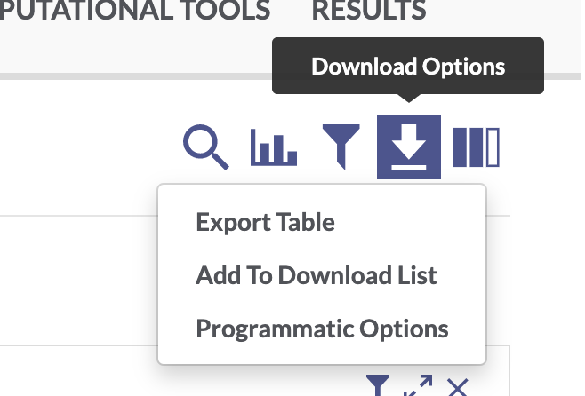

```{r, set-opts, include=FALSE}
knitr::opts_chunk$set(
  eval = TRUE
)
```

------------------------------------------------------------------------

## Setup

### Install and load packages

If you haven't already, install `synapser` (the [Synapse R client](https://r-docs.synapse.org/articles/synapser.html)), as well as the `tidyverse` family of packages.

```{r install-synapser, eval = FALSE}
# install synapser
install.packages("synapser", repos = c("http://ran.synapse.org", "http://cran.fhcrc.org"))

# install tidyverse if you don't already have it
install.packages("tidyverse")
```

We will also use the BioconductoR package manager to install `biomaRt`, which will help us with gene count data later.

```{r install-biomaRt, eval = FALSE}
#install.packages("XML")

if (!requireNamespace("BiocManager", quietly = TRUE))
    install.packages("BiocManager")

BiocManager::install("biomaRt")
```

Load libraries

```{r load-libraries, message=FALSE, warning=FALSE}
library(synapser)
library(tidyverse)
library(biomaRt)
```

### Login to Synapse

Next, you will need to log in to your Synapse account.

#### Login option 1: Synapser takes credentials from your Synapse web session

If you are logged into the [Synapse](https://www.synapse.org/) web browser, `synapser` will automatically use your login credentials to log you in during your R session! All you have to do is:

```{r synlogin, results = "hide"}

synLogin()
```

**If for whatever reason that didn't work,** try one of these options:

> #### Login option 2: Synapse username and password
>
> In the code below, replace the \<\> with your Synapse username and password.
>
> ```{r eval = FALSE}
> >
> synLogin("<username>", "<password>")
> ```
>
> #### Login option 3: Synapse PAT
>
> If you usually log in to Synapse with your Google account, you will need to use a Synapser Personal Access Token (PAT) to log in with the R client. Follow these instructions to [generate a personal access token](https://help.synapse.org/docs/Managing-Your-Account.2055405596.html#ManagingYourAccount-Loggingin), then paste the PAT into the code below. Make sure you scope your access token to allow you to View, Download, and Modify.
>
> ```{r eval = FALSE}
> >
> synLogin(authToken = "<paste your personal access token here>")
> ```
>
> For more information on managing Synapse credentials with `synapser`, see the documentation [here](https://r-docs.synapse.org/articles/manageSynapseCredentials.html).

------------------------------------------------------------------------

## Download data

While you can always download data from the AD Portal website via your web browser, it's usually faster and often more convenient to download data programmatically.

### Download a single file

To download a single file from the AD Knowledge Portal, you can click the linked file name to go to a page in the Synapse platform where that file is stored. Using the synID on that page, you can call the `synGet()` function from `synapser` to download the file.

#### Exercise 1: Use [Explore Data](https://adknowledgeportal.synapse.org/Explore/Data) to find processed RNAseq data from the Jax.IU.Pitt_5XFAD Study

This filters the table to a single file. In the "Id" column for this `htseqcounts_5XFAD.txt` file, there is a unique Synapse ID (synID).

{width="448"}

We can then use that synID to download the file.

```{r single-synGet, results = "hide"}

counts_id <- "syn22108847"
synGet(counts_id, downloadLocation = "files/")
```

### Bulk download files {#bulk-download-files}

#### Exercise 2: Use [Explore Studies](https://adknowledgeportal.synapse.org/Explore/Studies) to find all metadata files from the Jax.IU.Pitt_5XFAD study

Use the facets and search bar to look for data you want to download from the AD Knowledge Portal. Once you've identified the files you want, click on the download arrow icon on the top right of the Explore Data table and select "Programmatic Options" from the drop-down menu.

{width="300"}

In the window that pops up, select the "R" tab from the top menu bar. This will display some R code that constructs a SQL query of the Synapse data table that drives the AD Knowledge Portal. This query will allow us to download only the files that meet our search criteria.

{width="411"}

The function `synTableQuery()` returns a Synapse object wrapper around a CSV file that is automatically downloaded to a Synapse cache directory `.synapseCache` in your home directory. You can use `query$filepath` to see the path to the file in the Synapse cache.

```{r portal-query}
# download the results of the filtered table query
query <- synTableQuery("SELECT * FROM syn11346063.36 WHERE ( ( `study` HAS ( 'Jax.IU.Pitt_5XFAD' ) ) AND ( `resourceType` = 'metadata' ) )")

```

```{r query-filepath}

query$filepath
```

We'll use `read.csv` to read the CSV file into R (although the provided `read.table` or any other base R version is also fine!). We can explore the `download_table` object and see that it contains information on all of the AD Portal data files we want to download. Some columns like the "id" and "parentId" columns contain info about where the file is in Synapse, and some columns contain AD Portal annotations for each file, like "dataType", "specimenID", and "assay". This annotation table will later allow us to link downloaded files to additional metadata variables!

```{r download-query-table, paged.print=TRUE}
# read in the table query csv file
download_table <- read_csv(query$filepath, show_col_types = FALSE)

download_table
```

Finally, we use a mapping function from the `purrr` package to loop through the "id" column and apply the `synGet()` function to each file's synID. In this case, we use `purrr::walk()` because it lets us call `synGet()` for its side effect (downloading files to a location we specify), and returns nothing.

```{r bulk-download-purrr}
# loop through the column of synIDs and download each file
purrr::walk(download_table$id, ~synGet(.x, downloadLocation = "files/"))
```

Congratulations, you have bulk downloaded files from the AD Knowledge Portal!

**An important note:** for situations where you are downloading many large files, the R client performs substantially slower than the command line client or the Python client. In these cases, you can use the instructions and code snippets for the command line or Python client provided in the "Programmatic Options" menu.

------------------------------------------------------------------------

## Working with AD Portal metadata

### Metadata basics

We have now downloaded several metadata files and an RNAseq counts file from the portal. For our next exercises, we want to read those files in as R data so we can work with them.

We can see from the `download_table` we got during the bulk download step that we have five metadata files. Two of these should be the individual and biospecimen files, and three of them are assay meetadata files.

```{r explore-download-table}
#
download_table %>% 
  dplyr::select(name, metadataType, assay)
```

We are only interested in RNAseq data, so we will only read in the individual, biospecimen, and RNAseq assay metadata files.

```{r read-data-files, message=FALSE, warning=FALSE}
# counts matrix
counts <- read_tsv("files/htseqcounts_5XFAD.txt", show_col_types = FALSE)

# individual metadata
ind_meta <- read_csv("files/Jax.IU.Pitt_5XFAD_individual_metadata.csv", show_col_types = FALSE)

# biospecimen metadata
bio_meta <- read_csv("files/Jax.IU.Pitt_5XFAD_biospecimen_metadata.csv", show_col_types = FALSE)

#assay metadata
rna_meta <- read_csv("files/Jax.IU.Pitt_5XFAD_assay_RNAseq_metadata.csv", show_col_types = FALSE)
```

Let's examine the data and metadata files a bit before we begin our analyses.

#### Counts data

```{r view-counts}
# Calling a tibble object will print the first ten rows in a nice tidy output; doing the same for a base R dataframe will print the whole thing until it runs out of memory. If you want to inspect a large dataframe, use `head(df)`
counts
```

The data file has a column of ENSEMBL gene ids and then a bunch of columns with count data, where the column headers correspond to the specimenIDs. These specimenIDs should all be in the RNAseq assay metadata file, so let's check.

```{r view-assay}
# what does the RNAseq assay metadata look like?
rna_meta
```

```{r check-specIDs-data}
# are all the column headers from the counts matrix (except the first "gene_id" column) in the assay metadata?
all(colnames(counts[-1]) %in% rna_meta$specimenID)
```

#### Assay metadata

The assay metadata contains information about how data was generated on each sample in the assay. Each specimenID represents a unique sample. We can use some tools from dplyr to explore the metadata.

```{r check-assay}
# how many unique specimens were sequenced?
n_distinct(rna_meta$specimenID)

# were the samples all sequenced on the same platform?
distinct(rna_meta, platform)

# were there multiple sequencing batches reported?
distinct(rna_meta, sequencingBatch) 
```

#### Biospecimen metadata

The biospecimen metadata contains specimen-level information, including organ and tissue the specimen was taken from, how it was prepared, etc. Each specimenID is mapped to an individualID.

```{r check-biospecimen}
# all specimens from the RNAseq assay metadata file should be in the biospecimen file
all(rna_meta$specimenID %in% bio_meta$specimenID)

# but the biospecimen file also contains specimens from different assays
all(bio_meta$specimenID %in% rna_meta$specimenID)

```

#### Individual metadata

The individual metadata contains information about all the individuals in the study, represented by unique individualIDs. For humans, this includes information on age, sex, race, diagnosis, etc. For MODEL-AD mouse models, the individual metadata has information on model genotypes, stock numbers, diet, and more.

```{r check-individual}
# all individualIDs in the biospecimen file should be in the individual file
all(bio_meta$individualID %in% ind_meta$individualID)

# which model genotypes are in this study?
distinct(ind_meta, genotype)
```

#### Joining metadata

We use the three-file structure for our metadata because it allows us to store metadata for each study in a tidy format. Every line in the assay and biospecimen files represents a unique specimen, and every line in the individual file represents a unique individual. This means the files can be easily joined by specimenID and individualID to get all levels of metadata that apply to a particular data file. We will use the `left_join()` function from the `dplyr` package, and the `%>%` operator from the `magrittr` package. *If you are unfamiliar with the pipe, think of it as a shorthand for "take this (the preceding object) and do that (the subsequent command)". See [here](https://magrittr.tidyverse.org/) for more info on piping in R.*

```{r join-metadata}
# join all the rows in the assay metadata that have a match in the biospecimen metadata
joined_meta <- rna_meta %>% #start with the rnaseq assay metadata
  left_join(bio_meta, by = "specimenID") %>%  #join rows from biospecimen that match specimenID 
  left_join(ind_meta, by = "individualID") # join rows from individual that match individualID

joined_meta
```

We now have a very wide dataframe that contains all the available metadata on each specimen in the RNAseq data from this study. This procedure can be used to join the three types of metadata files for every study in the AD Knowledge Portal, allowing you to filter individuals and specimens as needed based on your analysis criteria!

### Single-specimen files

For files that contain data from a single specimen (e.g. raw sequencing files, raw mass spectra, etc.), we can use the Synapse annotations to associate these files with the appropriate metadata.

#### Excercise 3: Use [Explore Data](https://adknowledgeportal.synapse.org/Explore/Data) to find *all* RNAseq files from the Jax.IU.Pitt_5XFAD study.

If we filter for data where Study = "Jax.IU.Pitt_5XFAD" and Assay = "rnaSeq" we will get a list of 148 files, including raw fastqs and processed counts data.

#### Synapse entity annotations

When we download a single fastq from this list (for this example, `synID = syn22108503`), we can see the annotations associated with that file. In the interest of saving time for this workshop, we'll set `downloadFile = "FALSE"` to get the Synapse entity (i.e. all the file information in Synapse) without actually downloading the 3GB-ish file.

```{r json-single-file-annotations}
# download the file; set "downloadFile = FALSE"
fastq <- synGet("syn22108503", downloadFile = FALSE)

# file annotations are formatted as JSON strings and are a property of the Synapse object
fastq$annotations
```

```{r list-single-file-annotations}
# we can use the function synGetAnnotations() to extract the annotations as a nested list
file_annotations <- synGetAnnotations(fastq)

file_annotations
```

The file annotations let us see which study the file is associated with (Jax.IU.Pitt.5XFAD), which species it's from (Mouse), which assay generated the file (rnaSeq), and a whole bunch of other properties. Most importantly, single-specimen files are annotated with with the specimenID of the specimen in the file, and the individualID of the individual that specimen was taken from. We can use these annotations to link files to the rest of the metadata, including metadata that is not in annotations. This is especially helpful for human studies, as potentially identifying information like age, race, and Braak score is not included in file annotations.

```{r join-annotations-to-metadata}
# find records belonging to the individual this file maps to in our joined metadata
joined_meta %>% 
  filter(individualID == file_annotations$individualID[[1]])
```

#### Annotations during bulk download

When bulk downloading many files, the best practice is to preserve the download manifest that is generated which lists all the files, their synIDs, and all their annotations. If using the Synapse R client, follow the instructions in the [Bulk download files](#bulk-download-files) section above.

If we use the "Programmatic Options" tab in the AD Portal download menu to download all 148 rnaSeq files from the 5XFAD study, we would get a table query that looks like this:

```{r all-rnaseq-portal-query}
#
query <- synTableQuery("SELECT * FROM syn11346063.17 WHERE ( ( \"assay\" = 'rnaSeq' ) AND ( \"study\" HAS ( 'Jax.IU.Pitt_5XFAD' ) ) )")
```

As we saw previously, this downloads a csv file with the results of our AD Portal query. Opening that file lets us see which specimens are associated with which files:

```{r read-annotations-table, warning = FALSE, message = FALSE}
#
annotations_table <- read_csv(query$filepath, show_col_types = FALSE)

annotations_table
```

You could then use `purrr::walk(download_table$id, ~synGet(.x, downloadLocation = <your-download-directory>))` to walk through the column of synIDs and download all 148 files. However, because these are large files, it might be preferable to use the [Python client](https://python-docs.synapse.org/build/html/index.html) or [command line client](https://python-docs.synapse.org/build/html/CommandLineClient.html) for increased speed.

Once you've downloaded all the files in the `id` column, you can link those files to their annotations by the `name` column.

```{r match-annotations-to-file}
# we'll use the single fastq that we already downloaded as an example
# if we had downloaded the actual file, we could find it in the directory and search using the filename
# since wejust downloaded the Synapse entity wrapper object, we'll use the file name listed in the object properties
annotations_table %>% 
  filter(name == fastq$properties$name)
```

### Multispecimen files

Multispecimen files in the AD Knowledge Portal are files that contain data or information from more than one specimen. They are not annotated with individualIDs or specimenIDs, since these files may contain numbers of specimens that exceed the annotation limits. These files are usually processed or summary data (gene counts, peptide quantifications, etc), and are always annotated with `isMultiSpecimen = TRUE`.

If we look at the processed data files in the table of 5XFAD RNAseq file annotations we just downloaded , we will see that it isMultiSpecimen = TRUE, but individualID and specimenID are blank:

```{r filter-multispecimen-files}
#
annotations_table %>% 
  filter(fileFormat == "txt") %>% 
  dplyr::select(name, individualID, specimenID, isMultiSpecimen)
```

The multispecimen file should contain a row or column of specimenIDs that correspond to the specimenIDs used in a study's metadata, as we have seen with the 5XFAD counts file.

```{r join-multispecimen-metadata}
# In this example, we take a slice of the counts data to reduce computation, transpose it so that each row represents a single specimen, and then join it to the joined metadata by the specimenID
counts %>% 
  slice_head(n = 5) %>% 
  t() %>% 
  as_tibble(rownames = "specimenID") %>% 
  left_join(joined_meta, by = "specimenID")
```

------------------------------------------------------------------------

## RNASeq data exploration

We will use the counts data and metadata to do some basic exploratory analysis of gene expression in the Jax 5XFAD mouse model.

### Explore covariates

Which covariates from the metadata are we interested in?

```{r distinct-meta-covars}
# all samples are from the same organ and tissue, so we can probably discard those
distinct(joined_meta, organ, tissue, sampleStatus)

# we have different sexes and genotypes, so we are probably interested in those
distinct(joined_meta, sex, genotype)
```

For this example, we will plot gene expression by sex, genotype, and age.

#### Create timepoint column

The MODEL-AD individual mouse metadata contains columns with birth date and death date for each mouse. Using the **RNASeq methods description** from the [Jax 5XFAD study page in the AD Portal](https://adknowledgeportal.synapse.org/Explore/Studies/DetailsPage?Study=syn21983020), we expect this data to have equal numbers of individuals sampled at 4, 6, and 12 month timepoints. We can create a new column that captures this info in our joined metadata.

*Note: MODEL-AD studies added to the portal after June 2021 include an 'ageDeath' column that makes this simpler.*

```{r, add-timepoint-column, warning = FALSE, message = FALSE}
# load the lubridate package (comes with tidyverse)
library(lubridate)

# convert columns of strings to month-date-year format
joined_meta_time <- joined_meta %>% 
  mutate(dateBirth = mdy(dateBirth), dateDeath = mdy(dateDeath)) %>% 
  # create a new column that subtracts dateBirth from dateDeath in days, then divide by 30 to get months
  mutate(timepoint = as.numeric(difftime(dateDeath, dateBirth, units ="days"))/30) %>% 
  # convert numeric ages to timepoint categories
  mutate(timepoint = case_when(timepoint > 10 ~ "12 mo",
                               timepoint < 10 & timepoint > 5 ~ "6 mo",
                               timepoint < 5 ~ "4 mo"))
```

We now have balanced samples across sex, genotype, and age:

```{r group-metadata-by-covars}
# check that the timepoint column looks ok
joined_meta_time %>% 
  group_by(sex, genotype, timepoint) %>% 
  count()
```

#### Subset covariates

To reduce the width of the dataframe, we will subset only the columns that contain covariates we're interested in exploring further. Retaining the individualID and specimenID columns will make sure we can map the covariates to the data and back to the original metadata if needed!

```{r subset-covars}
# many packages have a "select" function that masks dplyr so we have to specify
covars <- joined_meta_time %>% 
  dplyr::select(individualID, specimenID, sex, genotype, timepoint)

# check the result
covars
```

### Join metadata to counts matrix

Return to the gene counts matrix we read in earlier.

```{r check-non-mouse-genes}
# check how many gene_ids are NOT from the mouse genome by searching for the string "MUS" (as in Mus musculus) in the gene_id column
counts %>% 
  filter(!str_detect(gene_id, "MUS"))

```

#### Convert ensembleIDs to common gene names

Transform the ensemblIDs in the matrix to common gene names, using the R package `biomaRt` (note: must specify to use the mouse database, although the two genes in the 5XFAD model we identified above are humanized and won't be translated by the program).

We will use the two custom functions below to convert ensemblIDs to gene names:

```{r gene-name-conversion-functions}
#this function uses biomaRt and converts ensemblIDs to HGNC names
convertEnsemblToHgnc <- function(ensemblIds){
  ensembl=biomaRt::useMart('ENSEMBL_MART_ENSEMBL',
                           dataset = 'mmusculus_gene_ensembl',
                           host='https:useast.ensembl.org')
  genes<-getBM(attributes = c('ensembl_gene_id','external_gene_name'),
               filters='ensembl_gene_id',
               values=ensemblIds,
               mart=ensembl)
  return(genes)
}

# this function calls the previous function and further converts HGNC names to Gene symbols
Make.Gene.Symb <- function(GeneENSG){
  GeneConv <- convertEnsemblToHgnc(GeneENSG)
  Symb <- as.character(c(1:length(GeneENSG)))
  for (i in 1:length(GeneENSG)){
    In <- which(GeneConv$ensembl_gene_id == GeneENSG[i])
    if (length(In)>0){
      Symb[i] <- GeneConv$external_gene_name[In]
    }
  }
  return(Symb)
}

```

Call the `Make.Gene.Symb()` function to add a new column with short gene names to our counts dataframe. This will take a minute -- there are over 55k genes in our matrix!

```{r convert-gene-ids}
# use the mutate function from dplyr
#named_counts <- counts %>% 
#  mutate(gene_name = Make.Gene.Symb(gene_id))
```

For this demonstration, I=instead of running biomaRt, which can be unreliable at times and take a long time to render, we will append a dataframe to our counts matrix with short gene names already translated

```{r}
#ensembl_to_gene <- subset(named_counts, select=c(gene_id, gene_name))
#write.csv(ensembl_to_gene, file="ensembl_translation_key.csv", row.names=FALSE)

ensembl_to_gene <- read.csv(file="ensembl_translation_key.csv")
named_counts <- dplyr::left_join(counts, ensembl_to_gene, by="gene_id")
```

Are the gene names unique?

```{r check-unique-genes}
# are all the gene names unique?
length(named_counts$gene_name) - n_distinct(named_counts$gene_name) 

# 71 duplicate gene names
```

We need to clean up the humanized gene names and append unique identifiers to the duplicate names.

```{r clean-gene-names}
#The first two genes in the matrix are the humanized genes PSEN1 (ENSG00000080815) and APP (	ENSG00000142192). Set these manually:
named_counts[1, "gene_name"] <- "PSEN1"
named_counts[2, "gene_name"] <- "APP"

#make all gene names unique and remove unneeded column
named_counts <- named_counts %>% 
  mutate(gene_name = make.unique(gene_name)) %>% 
  dplyr::select(-gene_id) %>% 
  column_to_rownames(var = "gene_name")

```

#### Transpose counts matrix and join to covariates

Now we can transpose the dataframe so that each row contains count data cross all genes for an individual, and join our covariates by specimenID.

```{r transpose-counts}
#
counts_tposed <- named_counts %>% 
  t() %>%  #transposing forces the df to a matrix
  as_tibble(rownames = "specimenID") %>% #reconvert to tibble and specify rownames
  left_join(covars, by = "specimenID") #join covariates by specimenID
```

```{r check-transposed-counts}
# check the transposed matrix looks ok
head(counts_tposed)
```

### Visualize gene count data

Create simple box plots showing normalized counts by genotype and time point, faceted by sex.

```{r refactor-timepoints}
# first make the timepoints column a factor and re-order the levels
counts_tposed$timepoint <- factor(counts_tposed$timepoint, levels=c("4 mo","6 mo","12 mo"))
```

Use ggplot to plot gene counts for each specimen by age, sex, and genotype.

```{r plot-trem2}
# load ggplot2
library(ggplot2)

#Look at Trem2 levels
g <- counts_tposed %>% 
  ggplot(aes(x=timepoint, y=Trem2, color=genotype)) +
    geom_boxplot() + 
    geom_point(position=position_jitterdodge()) +
    facet_wrap(~sex)

g
```

Examine any gene of interest by setting the y argument in the `ggplot(aes()` mapping equal to the gene name. Ex: `y = Cst7`

```{r plot-Cst7}
#
g <- counts_tposed %>% 
  ggplot(aes(x=timepoint, y=Cst7, color=genotype)) +
    geom_boxplot() + 
    geom_point(position=position_jitterdodge()) +
    facet_wrap(~sex)

g
```

Ex: `y = Apoe`

```{r plot-Apoe}
#
g <- counts_tposed %>% 
  ggplot(aes(x=timepoint, y=Apoe, color=genotype)) +
    geom_boxplot() + 
    geom_point(position=position_jitterdodge()) +
    facet_wrap(~sex)

g
```

Ex: `y = Kirrel2`

```{r plot-Kirrel2}
#
g <- counts_tposed %>% 
  ggplot(aes(x=timepoint, y=Kirrel2, color=genotype)) +
    geom_boxplot() + 
    geom_point(position=position_jitterdodge()) +
    facet_wrap(~sex)

g
```
