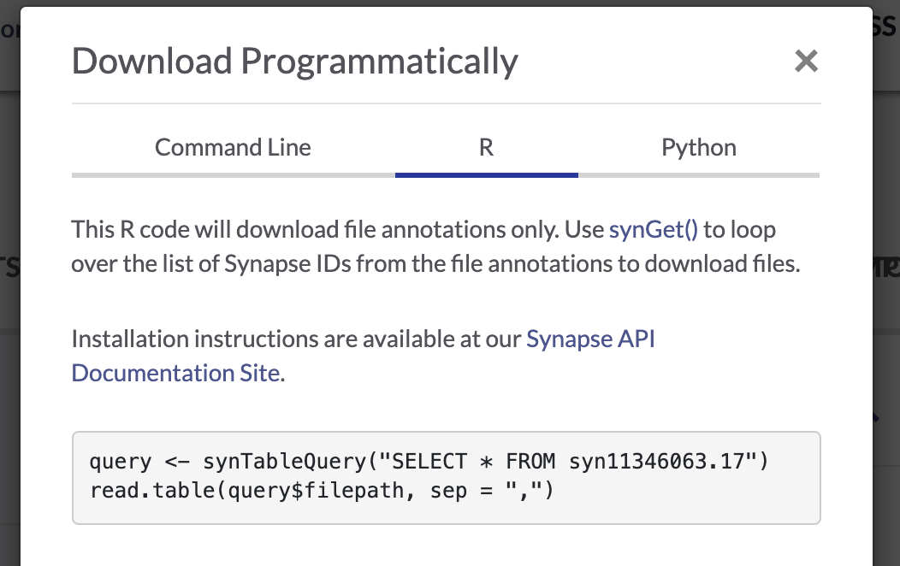

### Setup

Install `synapser`, the [Synapse R client](https://r-docs.synapse.org/articles/synapser.html).

```{r}
install.packages("synapser", repos = c("http://ran.synapse.org", "http://cran.fhcrc.org"))
```

You may already have some or all of these packages installed, but if not, install these as well!

```{r}
install.packages(c("purrr", "dplyr", "ggplot2"))
```

Next, you will need to log in to your Synapse account.

#### Login Option 1: Synapse username and password

In the code below, replace the \<\> with your Synapse username and password.

```{r}
# load the synapser package
library(synapser)

# login with your Synapser username and password
synLogin(username = "<username>", password = "<password>")
```

#### Login Option 2: Synapse PAT

If you usually log in to Synapse with your Google account, you will need to use a Synapser Personal Access Token (PAT) to log in with the R client. Follow these instructions to [generate a personal access token](https://help.synapse.org/docs/Managing-Your-Account.2055405596.html#ManagingYourAccount-Loggingin), then paste the PAT into the code below. Make sure you scope your access token to allow you to View, Download, and Modify.

```{r}
library(synapser)
synapser::synLogin(authToken = "<paste your personal access token here>")
```

### Download data

Single download:

```{r}
counts_id <- "syn22108848"
synGet(counts_id, downloadLocation = "files/")
```

Bulk download:

Use the facets and search bar to look for data you want to download from the AD Knowledge Portal. Once you've identified the files you want, click on the download arrow icon on the top right of the Explore Data table and select "Programmatic Options" from the drop-down menu.

{width="300"}

In the window that pops up, select the "R" tab from the top menu bar. This will display some R code that constructs a SQL query of the Synapse data table that drives the AD Knowledge Portal. This query will allow us to download only the files that meet our search criteria.

{width="500"}

Copy and paste this query into the next chunk of R code in this document, then execute it.

```{r}
# download the results of the filtered table query
query <- synTableQuery("SELECT * FROM syn11346063.17 WHERE ( ( \"study\" HAS ( 'Jax.IU.Pitt_5XFAD' ) ) AND ( \"resourceType\" = 'metadata' ) AND ( \"dataType\" IS NULL OR \"dataType\" = 'geneExpression' ) )")

# read in the table query csv file
download_table <- read.csv(query$filepath)

# loop through the column of synIDs and download each file
# if downloadLocation is not specified, files are downloaded to the Synapse cache by default
purrr::walk(download_table$id, ~synapser::synGet(.x, downloadLocation = "files/"))
```

The above code does three things:

1.  The function `synTableQuery()` returns a Synapse object wrapper around a CSV file that is automatically downloaded to a Synapse cache directory `.synapseCache` in your home directory. You can use `query$filepath` to see the path to the file in the Synapse cache.

2.  We use `read.csv` to read the CSV file into R. We can explore the `download_table` object and see that it contains information on all of the AD Portal data files we want to download. Some columns like the "id" and "parentId" columns contain info about where the file is in Synapse, and some columns contain AD Portal annotations for each file, like "dataType", "specimenID", and "assay". This annotation table will later allow us to link downloaded files to additional metadata variables!

3.  Finally, we use a mapping function from the `purrr` package to loop through the "id" column and apply the `synGet()` function to each file's synID. In this case, we use `purrr::walk()` because it lets us call `synGet()` for its side effect (downloading files to a location we specify), and returns nothing.

Congratulations, you have bulk downloaded data from the AD Knowledge Portal!

**An important note:** for situations where you are downloading many large files, the R client performs substantially slower than the command line client or the Python client. In these cases, you can use the instructions and code snippets for the command line or Python client provided in the "Programmatic Options" menu.

### Understanding metadata 

#### Read in data files

We have now downloaded three metadata files and an RNAseq counts file from the portal. For our next exercises, we want to read those files in as R data so we can work with them.

```{r}
# counts matrix
counts <- read.delim("files/tpm_gene_5XFAD.txt")

# individual metadata
ind_meta <- read.csv("files/Jax.IU.Pitt_5XFAD_individual_metadata.csv")

# biospecimen metadata
bio_meta <- read.csv("files/Jax.IU.Pitt_5XFAD_biospecimen_metadata.csv")

#assay metadata
rna_meta <- read.csv("files/Jax.IU.Pitt_5XFAD_assay_RNAseq_metadata.csv")
```

Let's examine the data and metadata files a bit before we begin our analyses.

#### Counts data

```{r}
head(counts)
```

The data file has a column of ENSEMBL gene ids and then a bunch of columns with count data, where the column headers correspond to the specimenIDs. These specimenIDs should all be in the RNAseq assay metadata file, so let's check.

```{r}
# what does the RNAseq assay metadata look like?
head(rna_meta)
```

Glancing at the `rna_meta$specimenID` column, it looks like the column headers in our counts file have somehow acquired an extra 'X'. We'll have to remove that in our downstream analysis in order to join the counts data to the metadata.

#### Assay metadata

The assay metadata contains information about how data was generated on each sample in the assay. Each specimenID represents a unique sample. For example, if we wanted to know whether the samples were sequenced in different batches, or using different platforms, we could run.

```{r}
unique(rna_meta$sequencingBatch) # all sequenced in one batch
unique(rna_meta$platform) # all run on the Illumina Novaseq 6000 platform
```

#### Biospecimen metadata

The biospecimen metadata contains specimen-level information, including organ and tissue the specimen was taken from, how it was prepared, etc. Each specimenID is mapped to an individualID.

```{r}
# all specimens from the RNAseq assay metadata file should be in the biospecimen file
all(rna_meta$specimenID %in% bio_meta$specimenID)

# but the biospecimen file also contains specimens from different assays
all(bio_meta$specimenID %in% rna_meta$specimenID)

```

#### Individual metadata

The individual metadata contains information about all the individuals in the study, represented by unique individualIDs. For humans, this includes information on age, sex, race, diagnosis, etc. For MODEL-AD mouse models, the individual metadata has information on model genotypes, stock numbers, diet, and more.

```{r}
# all individualIDs in the biospecimen file should be in the individual file
all(bio_meta$individualID %in% ind_meta$individualID)

# how many different model genotypes are in this study?
unique(ind_meta$genotype)
```

#### Joining metadata 

We use the three-file structure for our metadata because it allows us to store metadata for each study in a tidy format. Every line in the assay and biospecimen files represents a unique specimen, and every line in the individual file represents a unique individual. This means the files can be easily joined by specimenID and individualID to get all levels of metadata that apply to a particular data file. We will use the `left_join()` function from the `dplyr` package.

```{r}
library(dplyr)

# join all the rows in the assay metadata that have a match in the biospecimen metadata
left_join(rna_meta, bio_meta, by = "specimenID")

# join the resulting dataframe from above with the individual metadata and store
joined_meta <- left_join(left_join(rna_meta, bio_meta, by = "specimenID"), ind_meta, by = "individualID")
```

We now have a very wide dataframe that contains all the available metadata on each specimen in the RNAseq data from this study.

------------------------------------------------------------------------

### RNASeq data exploration

We will use the counts data and metadata to do some basic exploratory analysis of gene expression in the Jax 5XFAD mouse model.

#### Join metadata to counts matrix

Identify the individual specimens in the matrix, create an ID key to join the biospecimen IDs and individual IDs. The resulting metadata file will contain only the individuals in the matrix. (This is where we'll get rid of that extra "X" in the counts file column names).

```{r}
#first remove the leading X from the column names, which are the specimenIDs
colnames(counts) <- gsub("X","",colnames(counts))

#create a dataframe of the specimenIDs in the study from the counts matrix, removing the first column named "gene_id"
specimenID <- data.frame(specimenID = colnames(counts)[-1])

IDkey <- subset(bio_meta, select=c(individualID, specimenID))
#trim the IDkey down to include only those in the study:
IDkey <- dplyr::left_join(specimenID, IDkey, by="specimenID")
#the biospecimens metadata has both IDs needed to join the ind_meta and counts matrix
ind_meta2 <- dplyr::left_join(IDkey, ind_meta, by="individualID")
```

Add a column with simplified time points (4, 6, and 12 months).

```{r}
#take a look at time point designations:
table(ind_meta2$jobNumber)
```

\#recode for 4, 6, 12 months

```{r}
ind_meta2$timepoint <- ifelse(ind_meta2$jobNumber=='JAX 5xFAD 12mo', '12mo',
                              ifelse(ind_meta2$jobNumber=='JAX DMP 5xFAD 6month', '6mo', '4mo'))
table(ind_meta2$sex, ind_meta2$timepoint)
```

Transform the ensemblIDs in the matrix to common gene names, using the R package biomaRt (note: must use mouse database, though two genes in the 5XFAD are humanized and won't be translated by the program)

```{r}
#functions to convert ensemblIDs to gene names
convertEnsemblToHgnc <- function(ensemblIds){
  
  ensembl=biomaRt::useMart('ENSEMBL_MART_ENSEMBL',
                           dataset = 'mmusculus_gene_ensembl',
                           host='useast.ensembl.org')
  
  genes<-getBM(attributes = c('ensembl_gene_id','external_gene_name'),
               filters='ensembl_gene_id',
               values=ensemblIds,
               mart=ensembl)
  return(genes)
}
Make.Gene.Symb <- function(GeneENSG){
  
  #source('convertEnsemblToHgnc.R')
  GeneConv <- convertEnsemblToHgnc(GeneENSG)
  Symb <- as.character(c(1:length(GeneENSG)))
  
  for (i in 1:length(GeneENSG)){
    In <- which(GeneConv$ensembl_gene_id == GeneENSG[i])
    if (length(In)>0){
      Symb[i] <- GeneConv$external_gene_name[In]
    }
  }
  
  return(Symb)
  
}
#call the functions and add a new column
counts$gene_short_name <- Make.Gene.Symb(counts$gene_id)
```

Need to clean up the gene names a little, and assign them as row names

```{r}
#The first two genes in the matrix are the humanized genes PSEN1 (ENSG00000080815) and APP (	ENSG00000142192). Set these manually:
counts[1, "gene_short_name"] <- "PSEN1"
counts[2, "gene_short_name"] <- "APP"

#make all gene names unique and assign them as row names:
counts$gene_short_name <- make.unique(counts$gene_short_name)
rownames(counts) <- counts$gene_short_name

#delete unnecessary columns
counts$gene_id<-NULL
counts$gene_short_name<-NULL


#transpose the matrix, so genes are columns and individuals are rows
counts2 <- as.data.frame(t(counts))
#add back a specimenID column to the matrix and join the metadata to the entire data frame:
counts2$specimenID <- row.names(counts2)
counts2 <- dplyr::left_join(counts2, ind_meta2, by="specimenID")
View(counts2)
```

Create simple box plots showing normalized counts by genotype and time point, faceted by sex

```{r}
library(ggplot2)

#re-order time points
counts2$timepoint <- factor(counts2$timepoint, levels=c("4mo","6mo","12mo"))

#Look at Trem2 levels
g <- ggplot(counts2, aes(x=timepoint, y=Trem2, color=genotype))
g <- g + geom_boxplot() + geom_point(position=position_jitterdodge())
g <- g + facet_wrap(~sex)
g
```

Examine any gene of interest by calling it

```{r}
g <- ggplot(counts2, aes(x=timepoint, y=Cst7, color=genotype))
g <- g + geom_boxplot() + geom_point(position=position_jitterdodge())
g <- g + facet_wrap(~sex)
g
```

```{r}
g <- ggplot(counts2, aes(x=timepoint, y=Apoe, color=genotype))
g <- g + geom_boxplot() + geom_point(position=position_jitterdodge())
g <- g + facet_wrap(~sex)
g
```

```{r}
g <- ggplot(counts2, aes(x=timepoint, y=Kirrel2, color=genotype))
g <- g + geom_boxplot() + geom_point(position=position_jitterdodge())
g <- g + facet_wrap(~sex)
g
```

```{r}
```

```{r}
```
